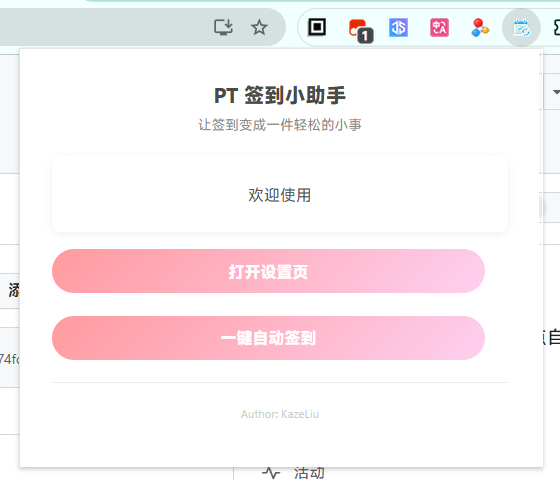

这里将一步一步告诉你如何使用本软件

## 第一步 ，点开图标，在里面点击`打开设置页`

## 添加页详解
在设置页面中点击`站点设置`，在右侧的添加按钮中点击`添加新站点`

- **快速预设** 这是快速添加站点，用于不喜欢看文档的人点两下应该就会使用新增站点了
- **站点名称** 站点名称自定义，想叫啥就叫啥，作为主键使用，不能重复（我好像忘记写重复判定了）
- **站点类型** 这个是重点，选错了就会签到失败,由于有些站的不可说属性，我只拿通用的出来解释
  - ONLINE：适用于馒头等不签到的站，主要是我看到有些人忘记在几个月内上线导致被封号，就添加了一个这个，签到的时候顺便访问一下页面，以免太久没上号被封号
  - nexusPHP：适用于所有使用`/attendance`作为签到页面的nexusPHP的站  
  - 其他：你们自己去通过名字去匹配
- **签到地址** 填写签到地址，这个地址是站点的签到按钮的链接或者是签到页面的网址，我会在下面介绍
  - ONLINE：反正只是访问一下，填写站点主域名就行
  - nexusPHP：填写完整的地址，就是点击签到后跳转的页面的地址，比如大青虫就填写：`https://cyanbug.net/attendance.php`
  - PTT：地址填写`https://www.pttime.org/attendance.php`
  - 其他：一部分是填写`签到按钮所在的网址`，一部分是填写`签到后跳转的页面的地址` (我真的很想直接贴网址，但是不清楚哪些是不可说)
- **是否跳过验证** 通过页面关键字来判定当前页面是否是等待验证的页面，如果启用，就不会去查看页面是不是有关键字。*因为有些签到页上会有关键字（比如cloudflare），导致页面是网站签到页但是会被判定为等待页，然后就会超时然后返回签到失败（其实是签到成功了），所以有这种情况的就需要关闭*
- **是否启用** 在签到主页中是否显示该站点
- **我的站点需要定制签到流程** 我没有的站那肯定是没有对应的签到流程了，毕竟不知道签到长啥样

## 其他功能
- **签到主页** 这是签到主页，点击签到按钮就可以签到
  - 再次签到：点一下执行单个的签到流程
  - 网址：点一下跳转到站点
- **推送设置** 去IYUU网站绑定后填入就可以推送消息了
- **控制台输出** 在浏览器中安F12进入开发者面板，点击控制台（console）可以查看软件流程
- 